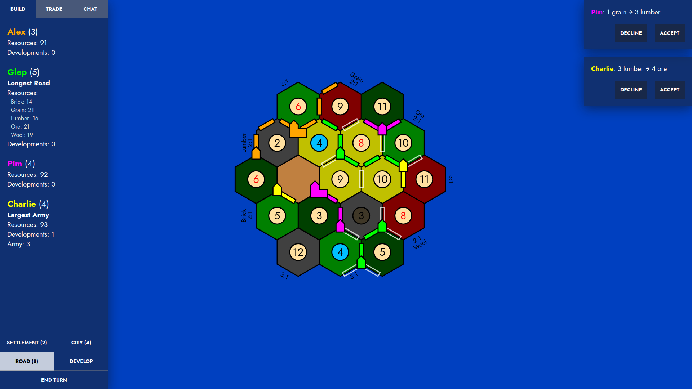

# Catan
A web-based multiplayer game inspired by the game mechanics of [Catan](https://en.wikipedia.org/wiki/Catan). 
## Requirements
- [catan-server](https://github.com/alexphanna/catan-server)
- http server
## Features
- Turn-based 4 player multiplayer using the websocket protocol
- SVG graphics for the zoomable map (Hexagonal tiles)
- Trading resources between players
- Chat with logged player actions
- Server-side action validation
- Vertex, edge, and tile universal coordinate systems
## Screenshots
