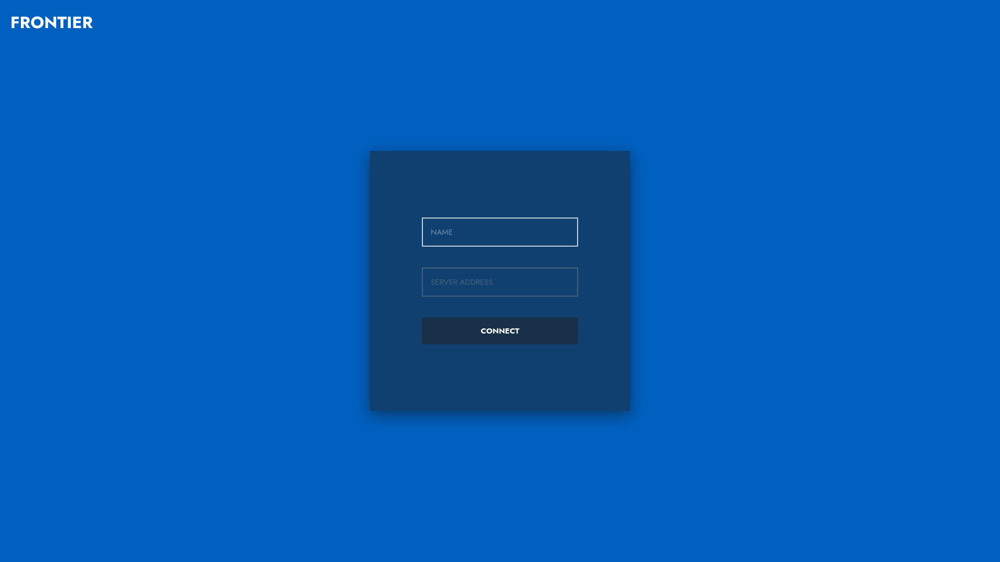
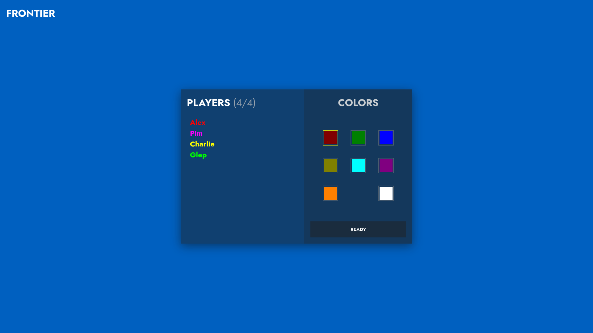
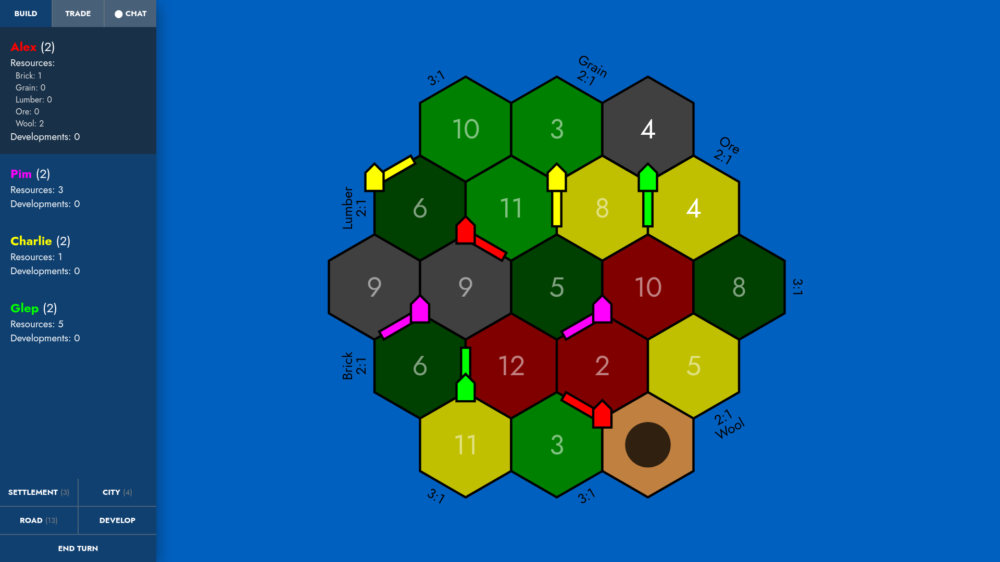

# Frontier
A web-based multiplayer game inspired by the game mechanics of [Catan](https://en.wikipedia.org/wiki/Catan). 
## Features
- Building, trading, and developing
- Client-server multiplayer using the WebSocket protocol
- Minimal sidebar user interface with notifications
- Interactive SVG map, which is zoomable and pannable
## Requirements
- [frontier-server](https://github.com/alexphanna/frontier-server)
## Screenshots

    
    

